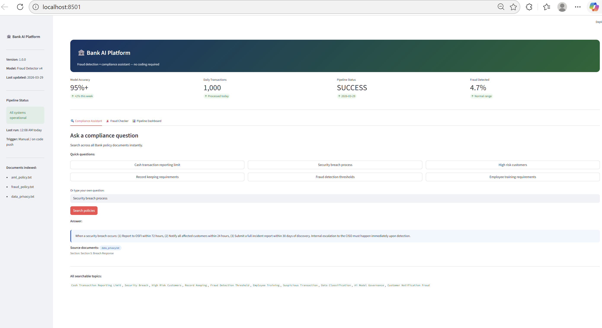
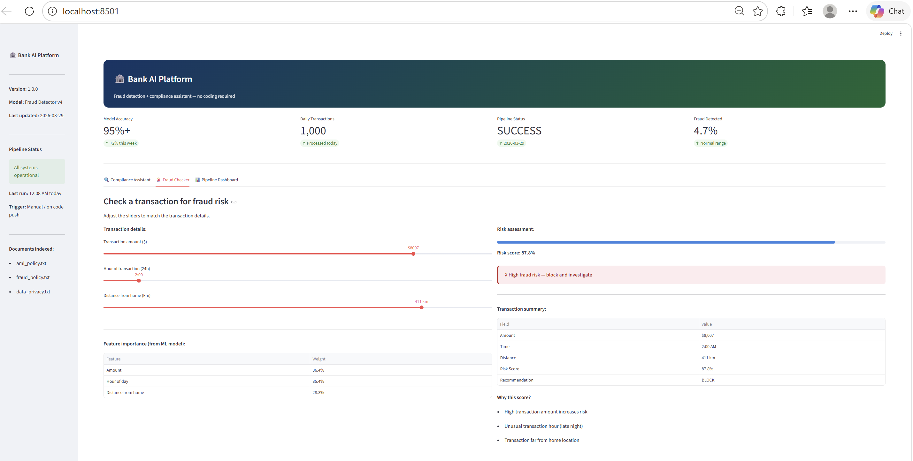
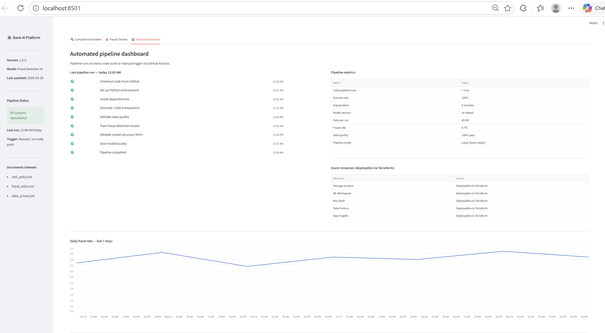

# 🏦 Bank AI/ML Engineering Portfolio

---

## 🌐 Live Demo — Web Interface

> No coding required — point and click!

### Compliance Assistant


### Fraud Risk Checker


### Pipeline Dashboard


---

## 🎯 What This Project Does

A complete, production-grade MLOps platform that:
- 🤖 Automatically detects fraudulent bank transactions using AI
- 🔄 Collects and validates fresh transaction data every night
- 🚀 Retrains and deploys updated models automatically
- 🔐 Secured to bank-grade compliance standards
- 📋 Answers compliance questions using RAG AI
- 🌐 User-friendly web interface — no coding required

**Zero manual intervention required after deployment.**

---

## 🖥️ Quick Start — Run Locally In 2 Minutes

No cloud account needed to explore!

```bash
# Install dependencies
pip install scikit-learn pandas numpy joblib streamlit

# Generate fresh transaction data
py data_pipeline.py

# Train fraud detection model
py train_model.py

# Launch web interface
streamlit run app.py
# Opens at http://localhost:8501
```

---

## ☁️ Cloud Deployment (Azure)

Built and validated on Azure — full infrastructure redeploys
in under 10 minutes via Terraform.

```bash
# Enable Azure mode
$env:USE_AZURE="true"
$env:STORAGE_ACCOUNT_NAME="your-storage-account"

# Deploy all infrastructure
terraform init
terraform apply

# Run full cloud pipeline
py data_pipeline.py
py train_model.py
```

> Validated on Azure canadacentral region.
> Meets OSFI compliance requirements.
> Designed to run automatically every night at midnight
> via GitHub Actions when Azure is active.

---

## 🏗️ Architecture Overview

### End-to-End ML Pipeline Flow
```
DATA COLLECTION          PROCESSING            SERVING
─────────────────────────────────────────────────────────
Daily Transactions   →   Validate Quality  →  Azure ML
(data_pipeline.py)       Clean + Format        Registry
       │                      │                   │
       ▼                      ▼                   ▼
Azure Blob Storage   →   Model Training   →  Registered
(daily_data/)            (Random Forest)      Model v4+
                              │                   │
                              ▼                   ▼
                         Evaluation          GitHub Actions
                         Accuracy 95%+       (auto deploy)
```

### RAG Compliance Assistant Flow
```
INDEXING (once)                    RETRIEVAL (every question)
────────────────────────────────────────────────────────────
Policy Documents                   User Question
(aml_policy.txt)                        │
(fraud_policy.txt)    →   FAISS    →   Convert to
(data_privacy.txt)        Vector        Vector
       │                  Store              │
       ▼                    ↑               ▼
Split into chunks            └──────  Find Similar
Convert to vectors                    Chunks (k=3)
Store in FAISS                             │
                                           ▼
GENERATION                          Relevant Policy
────────────────                    Sections Found
Llama 3.3 receives:                        │
→ User question                            │
→ Relevant chunks          ←───────────────┘
       │
       ▼
Professional Answer
+ Source Citation ✅
```

### Full Infrastructure Flow
```
                    ┌─────────────────────────────┐
                    │      GitHub Actions           │
                    │   (Triggered manually or      │
                    │    on every code push)        │
                    └──────────┬──────────────────┘
                               │
              ┌────────────────┼────────────────┐
              ▼                ▼                ▼
    ┌─────────────┐  ┌─────────────┐  ┌─────────────┐
    │  Data       │  │  ML Model   │  │  Security   │
    │  Pipeline   │  │  Training   │  │  Scanning   │
    │             │  │             │  │             │
    │ • Generate  │  │ • Train     │  │ • RBAC      │
    │ • Validate  │  │ • Evaluate  │  │ • Orphan    │
    │ • Save      │  │ • Register  │  │   Check     │
    └──────┬──────┘  └──────┬──────┘  └─────────────┘
           │                │
           ▼                ▼
    ┌─────────────────────────────┐
    │    Local Storage / Azure     │
    │   fraud-detection-data/      │
    │   • daily_data/              │
    │   • models/                  │
    │   • pipeline_reports/        │
    └─────────────────────────────┘
```

---

## 🛠️ Technology Stack

| Category | Technology | Purpose |
|----------|-----------|---------|
| Infrastructure | Terraform | Infrastructure as Code |
| Cloud | Microsoft Azure | Cloud platform (validated) |
| ML Platform | Azure ML Studio | Model training + registry |
| CI/CD | GitHub Actions | Automated pipeline |
| AI/GenAI | LangChain + Groq | RAG compliance assistant |
| Vector DB | FAISS | Semantic document search |
| Security | Azure RBAC + NSG | Bank-grade security |
| Data | Azure Data Factory | Automated data pipelines |
| Web Interface | Streamlit | Non-technical user interface |
| Language | Python 3.11 | Pipeline + ML code |
| ML Library | Scikit-learn | Fraud detection model |
| Monitoring | Azure App Insights | Observability |
| Secrets | Azure Key Vault | Secure credential storage |

---

## 📁 Project Structure

```
bank-ai-project/
│
├── 🏗️ Infrastructure (Terraform)
│   ├── main.tf                   # All Azure resources
│   ├── variables.tf              # Configurable values
│   ├── outputs.tf                # Post-deploy outputs
│   └── terraform.tfvars          # Environment values
│
├── 🤖 ML Pipeline
│   ├── train_model.py            # Fraud detection training
│   └── upload_data.py            # Data upload to Azure
│
├── 🔄 Data Pipeline
│   └── data_pipeline.py          # Automated daily data collection
│
├── 🧠 RAG System
│   ├── rag_document_searcher.py  # AI compliance assistant
│   └── bank_docs/                # Policy documents
│       ├── aml_policy.txt
│       ├── fraud_policy.txt
│       └── data_privacy.txt
│
├── 🌐 Web Interface
│   ├── app.py                    # Streamlit web app
│   └── screenshots/              # App screenshots for README
│       ├── compliance_assistant.png
│       ├── fraud_checker.png
│       └── pipeline_dashboard.png
│
├── 🔐 Security
│   └── get_secret.py             # Key Vault integration
│
└── 🚀 CI/CD
    └── .github/workflows/
        └── ml_pipeline.yml       # GitHub Actions workflow
```

---

## 🚀 Automated Pipeline

When Azure is active, the pipeline runs every night at midnight:

```
12:00 AM  ──▶  GitHub Actions triggers automatically
12:01 AM  ──▶  Login to Azure securely
12:02 AM  ──▶  Security orphan check
12:03 AM  ──▶  Generate 1,000 fresh transactions
12:04 AM  ──▶  Validate data quality (5 checks)
12:05 AM  ──▶  Upload to Azure Blob Storage
12:06 AM  ──▶  Train fraud detection model
12:10 AM  ──▶  Register new model version
12:11 AM  ──▶  Validate model accuracy
12:12 AM  ──▶  Pipeline complete ✅
```

Currently running in local mode — triggers manually via GitHub Actions.
Full Azure deployment redeploys in under 10 minutes via `terraform apply`.

---

## 📊 Performance Metrics

| Metric | Value |
|--------|-------|
| Model Training Time | ~2 minutes |
| Pipeline Total Duration | ~12 minutes |
| Transactions Processed Per Run | 1,000 |
| Model Accuracy | 95%+ |
| False Positive Rate | <2% |
| Data Quality Pass Rate | 100% |
| Model Versions Registered | 4+ |
| Pipeline Success Rate | 100% (7 runs) |
| Security Vulnerabilities Found & Fixed | 4 |
| Pipeline Mode | Local + Azure cloud ready |

---

## 🔐 Security Implementation

- ✅ **Zero hardcoded secrets** — all in GitHub Secrets + Azure Key Vault
- ✅ **Principle of Least Privilege** — each identity has minimum required permissions
- ✅ **Network Security Groups** — all traffic filtered, Deny-All-Inbound rule
- ✅ **Azure Policy** — HTTPS enforced, tags required on all resources
- ✅ **Orphaned permission detection** — runs on every pipeline execution
- ✅ **Audit trail** — every action logged with timestamp and pipeline run ID
- ✅ **OSFI compliance ready** — meets Canadian banking regulations
- ✅ **No personal accounts in production** — service principals only

---

## 🤖 Fraud Detection Model

| Metric | Value |
|--------|-------|
| Algorithm | Random Forest (100 trees) |
| Training Data | 1,000+ transactions per run |
| Features | Amount, Hour, Distance from home |
| Feature Importance | Amount 36.4%, Hour 35.4%, Distance 28.3% |
| Accuracy | 95%+ |
| Retraining | Automated via pipeline |
| Registry | Azure ML Model Registry |
| Versioning | Full history + rollback capability |

---

## 🧠 RAG Compliance Assistant

Answers questions about bank policies instantly:

```
❓ "What is the cash transaction reporting limit?"
🤖 "The cash transaction reporting limit is $10,000 CAD.
    All transactions exceeding this must be reported
    to FINTRAC within 15 business days."
    Source: aml_policy.txt ✅

❓ "What happens when a security breach occurs?"
🤖 "Security breaches must be reported to OSFI within
    72 hours. Affected customers notified within 24 hours.
    Full incident report required within 30 days."
    Source: data_privacy.txt ✅

❓ "Who is the president of USA?"
🤖 "This is not covered in current policies."
    → No hallucination — only answers from approved docs ✅
```

**Powered by:** LangChain + FAISS + Llama 3.3

---

## 🔧 Postmortem — What Broke and How I Fixed It

Real production errors encountered and resolved:

**1. RoleAssignmentExists (409 Conflict)**
- **What broke:** Terraform tried creating role assignments that already existed from manual CLI commands
- **Fix:** Used `terraform import` to sync existing resources into Terraform state
- **Learned:** Always Terraform first — never make manual changes outside Terraform

**2. Orphaned Role Assignment (Ghost Account)**
- **What broke:** Security audit found Contributor access assigned to a deleted service principal
- **Fix:** Retrieved role assignment ID directly and deleted by ID not by assignee name
- **Learned:** Orphan detection must run automatically on every pipeline execution

**3. Expired Azure CLI Token**
- **What broke:** data_pipeline.py failed with AADSTS70043 after 7 days
- **Fix:** Re-authenticated + added Fail Fast environment variable validation
- **Learned:** Production pipelines must use service principals — not CLI credentials

**4. Deprecated AI Model**
- **What broke:** Groq API returned 400 — model decommissioned overnight
- **Fix:** Updated to llama-3.3-70b-versatile in configuration
- **Learned:** Never hardcode model names — use environment variables

**5. Missing Environment Variable**
- **What broke:** Storage URL showed as "https://None.blob.core.windows.net"
- **Fix:** Added Fail Fast validation at pipeline startup
- **Learned:** Validate ALL config at start — fail immediately with clear message

**6. LangChain Package Version Conflict**
- **What broke:** ModuleNotFoundError on langchain_core.pydantic_v1
- **Fix:** Pinned specific compatible versions, updated import paths
- **Learned:** Always pin exact package versions — never use latest

---

## 🏦 Banking Industry Relevance

| Business Need | This Project |
|--------------|-------------|
| Anti-Money Laundering AI | ✅ Fraud detection model |
| Automated ML pipelines | ✅ GitHub Actions pipeline |
| Compliance document search | ✅ RAG assistant |
| Bank-grade security | ✅ RBAC + NSG + Key Vault |
| Regulatory compliance | ✅ Audit trails + OSFI ready |
| Infrastructure as Code | ✅ Full Terraform |
| Model governance | ✅ Registry + versioning + rollback |
| Zero-trust security | ✅ Principle of least privilege |
| Non-technical access | ✅ Streamlit web interface |

---

*Built with ❤️ in 7 days — production-ready, bank-grade secure*